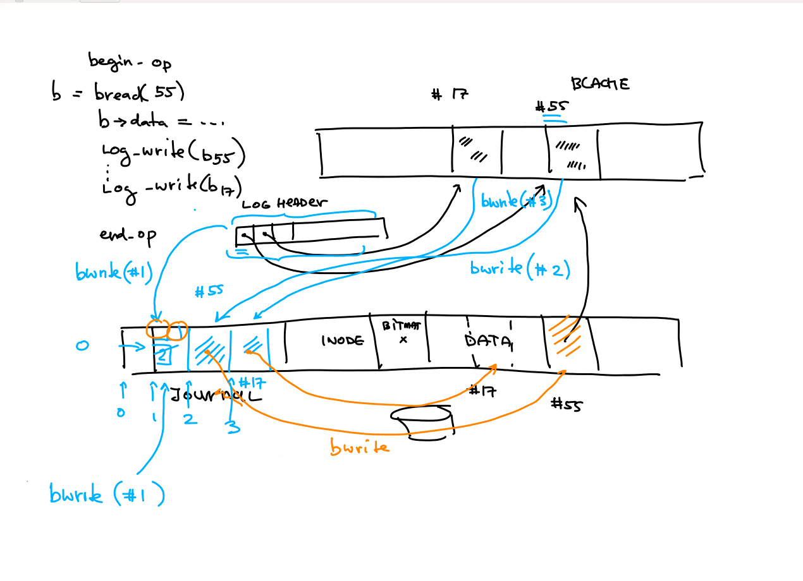

# WHY WE NEED FILE SYSTEM?
- role of file system in the OS hierarchy?
    - persistent storage.
        - but disk also provide file storage why do we need file system over it?
            - hierarchical organization with human readable names is more ergonomic.
    - consistency.
        - you cannot do half write.
        - you cannot leak resources. block occupied by some file which are not reachable.
        - crash recoverability.
            - if loose power then you can recover.
    - sharing.
        - if multiple app access disk then how to decide which app gets which space?
        - how to make sure each process has enough access to disk.
        - create an illusion of unlimited file size by adding more disks resources.

- what is a file system?
    - it's a collections of data structures which are on disk.
    - they are persistent in between reboots.
    - some data structures are maintained in memory because it's efficient. If you access same file over and over again then cache the metadata and parts of file in memory. IMPLEMENTED USING BUFFER CACHE.

- DIRECTORIES
    - these are just regular files maintained on the disk.

- Crash recovery
    - create a new file named foo.
    - first write grab one free block and mark it not free.
    - second write make recording in directory to link new grabbed block to new file.
    - if second write fails then we've leaked the block.
    - so we need these 2 write to happen atomically.
    - for this file system maintains journal to accumulate all writes and recover all the writes from journal on reboot.
    - this ensures that file system is in consistent state.

- NVMe: Non volatile memory ssd attached on PCE bus
    - access block: 2000-10000 cycles
---
# Block layer
- Buffer cache:
    - responsible for communication with block devices (disk device).
    - maintains cache of most frequently accessed blocks on block devices (disks).
    - Synchronize across multiple readers and writers.
        - acquires a lock and only process at a time will be allowed to write into this block.
        - first it'll be a write in memory then i'll be propagated down to disk.

# Inodes and Block allocator
- Inodes:
    - don't have names they have numbers.
    - they have information about which block have the actual data on disk.
    - for example: logical block number 0 is found on physical block number 55.

# Directory inodes
- Directories
    - contains information about human readable names and pointer to other inodes.
    - it contains mappings of file names/sub directories to inodes for ex
        - file Foo: inode number # 15.
    - file system names which is the root directory.

# System call
- I will allow to open a file.
- I will create a file descriptor for this file.
- I will create inside the File Descriptor Table a pointer to file data structure that i'll maintain in memory for this file.
- Then you can read and write from this file.

- Some additional resources are available via IOCTL interface.


---
#VFS: virtual File System
- allows one kernel to work with any File system that implements this VFS interface.
- is the idea that all OS will fix the interface.
- then the kernel will use to functions of this VFS layer.
- and each file system will register functions for this VFS.
---
- bit map: 
    - contains information about which block are free and available.

- **EACH BLOCK IS 512 Bytes**
---
# Representing files on disk
```c
// in−memory copy of an inode
struct inode {
    uint dev; // Device number
    uint inum; // Inode number
    int ref; // Reference count
    int flags; // I_BUSY, I_VALID

    short type; // copy of disk inode
    short major;
    short minor;
    short nlink;
    uint size;
    uint addrs[NDIRECT+1];
}
```
- nlink: number of links
    -  Number of times inode is linked or has different names.
    -  when nlinks becomes zero
        - using unlink system call: you unlink the file
        - inode becomes free
        - the data of the inode is release back in to the files system
        - you delete the file
- size: size of the file.
- addrs: addresses array
    - each entry is 4 bytes.
    - for small files the first 12 direct block will be immediately resolve to data block. this saves time as no more disk accesses. 
    - for files size larger then 12 file blocks: xv6 have pointer to next 128 blocks.
        - this gives use the max file size of 71680 bytes.
        ```python
        >>> (128+12)*512
        71680
        ```
        - the second layer of 128 block will have 4*128=512 bytes size.
    - for virtual file inode if you want to know which block number have the data for the ith (0 indexed, say 5th) block you just look up ith address for it.

- the size of allocated for the inodes in the disk or size of the inodes arrays in memory limits the number of unique inodes you can have in the system.
    - no of unique inodes = floor(size allocated for inodes / size of one inode)
    - as we can have multiple files for each inode the number of files is limited by the nlink limit.
        - no of unique files = no of unique inodes * max nlink value.
    - we can always reset and resize the inodes size in disk in xv6.

---
# Buffer cache layer.
- LRU maintained in doubly linked list in memory.
    - head.next is most recently used.
- processes can open same file and update them concurrently. Buffer cache layer has locks to maintain consistency.
- why not to use a hash table?
    - we have the amortized constant time access because of LRU property of the doubly linked list.
- bwrite: for writing a block in buffer cache you first acquire it in cache by bread. after iderw the B_DIRTY flag will be released.
- after bread we have to copy data to this block.
```c
memmove(dbuf−>data, lbuf−>data, BSIZE); // copy block to dst
```
- iderw(b): flush the buffer block to disk.
---
- bwrite puts data to disk for every call.
    - when you do write you group them in transactions.
    - like w1, w2 and w3.
    - i can change implementation of bread. if i can't find an available clean block then i write back any B_DIRTY block (maybe w3 here) to disk and get that block as new read. This is write back policy.
    - here if we don't have logging then here we loose consistency w3 was flushed but w1 and w2 are not flushed. so if loose power then we loose w1 and w2.
    - so we always write all writes group together.
---
- **EXAM QUESTIONS**
    - how ofter the write hit the file systems.
---
# logging layer
- types of inconsistencies:
    - double allocated: because the write to bit map area failed.

```c
struct logheader {
    int n;
    int block[LOGSIZE];
};

```
- block: array of block numbers. keeps track of which block number are participating in this transaction.
- n: size of this transactions.

```c
struct log {
    struct spinlock lock;
    int start;
    int size;
    int outstanding; // how many FS sys calls are executing.
    int committing; // in commit(), please wait.
    int dev;
    struct logheader lh;
}
```
- maintains state of the journal.
- outstanding: the number of outstanding transactions.
    - to be committed all at once.
    - because you can execute multiple transaction in parallel.
    - multiple different processes can do multiple system calls in parallel.
- committing: flag weather the transaction is committing.
    - all subsequent system call will have to wait for transaction to commit.
- start: which block number on the disk we have the first available space for storing the logging transactiona.
---
- xV6 have limited size of logging area.
    - it'll limit the size of each transaction.
    - and number of concurrent transaction it can support.

---
- end_op
    - 1st one maintains the guarantees that there will always be enough space in the logging areas across multiple transactions.
---
- commit()
    - 

```c
// Copy modified blocks from cache to log.
static void
write_log(void)
{
int tail;
    for (tail = 0; tail < log.lh.n; tail++) {
        struct buf *to = bread(log.dev, log.start+tail+1); // log block
        struct buf *from = bread(log.dev, log.lh.block[tail]); // cache block
        memmove(to−>data, from−>data, BSIZE);
        bwrite(to); // write the log
        brelse(from);
        brelse(to);
    }
}
```
- DOUBT: **EXAM**: when does the bwrite(from) happens so that we reset the ~B_DIRTY in that.

---
# RECAP
- transactions can touch inode and bitmap ares in addition to journal and data area.

- buffer cache and log header are in memory
---
- **EXAM: log.lh.n + (log.outstanding+1)*MAXOPBLOCKS > LOGSIZE; //what is this check in begin_op***
    - log.outstanding counts the number of system calls that have reserved log space
    - the total reserved space is log.outstanding times MAXOPBLOCKS.
    - Incrementing log.outstanding both reserves space. 
    - The code conservatively assumes that each system call might write up to MAXOPBLOCKS distinct blocks.
    - transactions can touch the inode and bitmap area because when you add a block to a file essentially grow the file by one and you have to write into the bitmap area, to make sure that you mark this individual as taken.
---
# bmap
```c
static uint
bmap(struct inode *ip, uint bn)
{
    if(bn < NDIRECT){
        if((addr = ip−>addrs[bn]) == 0)
            ip−>addrs[bn] = addr = balloc(ip−>dev);
        return addr;
    }
    bn −= NDIRECT;

    if(bn < NINDIRECT){
        // Load indirect block, allocating if necessary.
        if((addr = ip−>addrs[NDIRECT]) == 0)
            ip−>addrs[NDIRECT] = addr = balloc(ip−>dev);
        bp = bread(ip−>dev, addr);
        a = (uint*)bp−>data;
        if((addr = a[bn]) == 0){
            a[bn] = addr = balloc(ip−>dev);
            log_write(bp);
        }
        brelse(bp);
        return addr;
    }
}
```
- ip−>addrs[bn] = addr = balloc(ip−>dev);
    - if we are bmap inside the write function then we use balloc to allocate new address in the disk and update addr and ip->addr[bn].
- ip−>addrs[NDIRECT] = addr = balloc(ip−>dev);
    - allocates next level of indirect 128 blocks.
---
- **can write be too large for journaling area**
    - line 140 - 145 in file.c  
    - inside filewrite, it splits the write into multiple transactions.
    - each write is small transactions, although the whole loop is much larger.
    - other wise writing MB in KB is small

    - **WHY IS THIS CONSISTENT**
        - because one of the transaction might allocate additional entires in inode, which will affect the bitman of free available blocks and inode on the disk.
        - because each small transaction is consistent.
---
