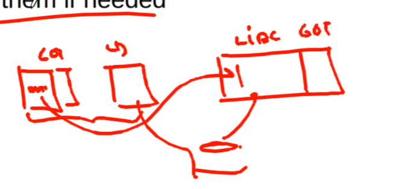

- dynamic libraries need Position Independent Code (PIC).
- benefit of shared library.
    - for instance, people who handle lib.c is provided as static library.
    - don't have to handle the compilation of lib.c and just link and run.
    - saving disk space.
    - saves runtime memory cost.

- mechanism for dynamically shared library: page table allow us to map one physical memory of library function like printf and map to multiple virtual memory.
    - find undefined symbols and path to where it's resolved later.

- why can't we just fix a unique particular address for each specific shared libraries.
    - because there are way too many libraries and version.
    - there is a possibility that that unique address can be occupied. Other library grew in size etc.

- that's why we need Position Independent Code (PIC).
    - to be able to move the code/text section of libraries up and down in the virtual memory without any change.

---
# How PIC is implemented?
- added layer of indirection to all global data and imported functions's references.
- point to table entry, whose value contains the actual address of the referenced global data or imported function.
- this table is called Global offset table (GOT).
- it starts from the beginning of Data segment.
- the distances between this table(GOT table which is located in the data section) and the code section remains constant.
- each process has it's own private GOT.
- linker patches value into the GOT table at relocation time.
---
# How to find current codes memory address at run time?
- in 64 bit architecture, it's allowed to use relative address to EIP, not in 32 bit architecture.
    - EIP instruction pointer relative addressing.
- use the below trick
```x86asm
    call L2; this puts the return address that is the next address in stack.
L2: popl %ebx; which is popped here, and it hence fetches EIP into a register.
    add $FF0, %ebx; add fixed distance = $FF0 from code to start of GOT.
```

```x86asm
43f call 45a <__i686.get_pc_thunk.cx>
444 add ecx, 0x1bb0; <- ESP points here after function call to thunk and we are now adding offset = 0x1bb0 to GOT. 
...
...

45a <__i686.get_pc_thunk.cx>:
45a mov ecx, DWORD PTR [esp]
45d ret
```
---
# problem with GOT and need of PLT ( procedure linkage table )
- number of global variables are small, so GOT for functions is large.
- so everything a library is used we need to create GOT for functions in the library that may not even be used. so linking and resolved them eagerly it takes time.
- so we use late binding/lazy procedure call: linking only when used.

---
# PLT
- in PLT prepare resolver = prepare arguments to resolver function that does the symbols dereference and binding.
- It is the part of the text sections.
- It is saved only once in the physical memory and is same amongst different instance of library uses, as there is nothing to relocate in PTL.

---
- Data sections(which contains the GOT) are not shared amongst different processes of libraries like lib.c.
- each process has a private GOT.
---
# How do we start statically linked program.
- main is not the first function that gets to run.
- there is a notion or constructors and destructors
    - for opening some file that are used by some libraries.
- after main we execute the destructors.
    - for closing the files.

- the order of execution when set  `backtrace past-main` on in gdb.
```
_main()
__libc_start_main
_start()
```
---
# How do we start dynamically linked program.
- map elf section -> load and start ld.so (linker) -> initialize ld.so (linker) -> find names of shared libraries required.
- relocate the lib.c into the memory and patch it's GOT table.
- libraries are loaded recursively.

- linker initialization of itself.
    - it reallocates itself in memory.

---
- why not to use global variables
    - because it'll make the code slow.
    - GOT will bet larger and extra memory deference can have a high cost due to cache misses.
---
- what happens when you call exec?
    - Kernel reads the program from disk
    - Kernel can handle multiple executable formats
    - It tries all of them one by one until it succeeds
    - E.g. it can execute scripts by noticing that the program starts with #!
    - We’ll concentrate on ELF

- Initializers and finalizers
- C++ needs a segment for invoking constructors for static variables
    - List of pointers to startup routines
        – Startup code in every module is put into an anonymous startup routine
        – Put into a segment called .init
- Problem
    - Order matters
    - Ideally you should track dependencies
        – This is not done
    - Simple hack
        – System libraries go first (.init), then user (.ctor)



main -> loader -> libraries
- loades libraries and patches GOT and PLT tables.

- we also need to initialize the constructors and destructors before calling main of the exec ed program command.